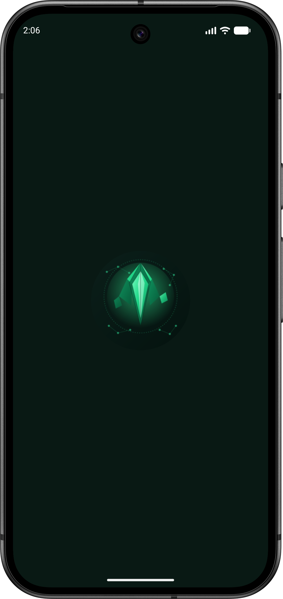
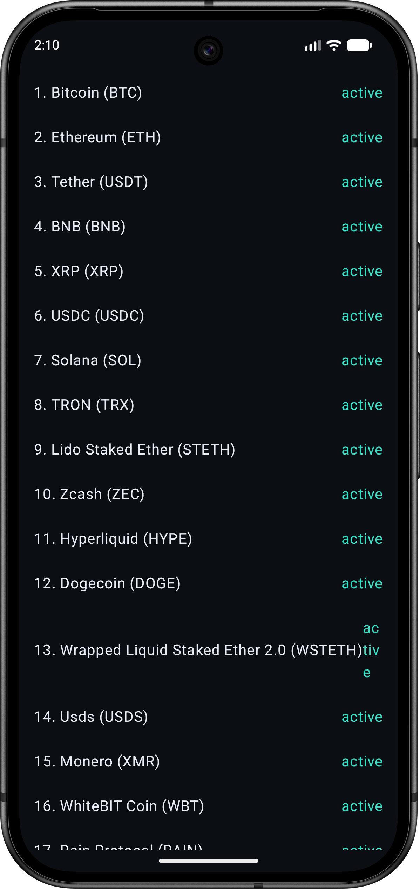

# Cryptonite

A small Android app for browsing cryptocurrency listings and coin details, built with Jetpack Compose and Clean Architecture (MVVM).

Data comes from the [CoinPaprika API](https://coinpaprika.com/api/).

## Screenshots

<p>
  
  
  
</p>

## Features

- Browse the full list of coins with rank, name, symbol, and active status
- Tap a coin to view its details: description, category tags, and team members

## Tech Stack

- **UI:** Jetpack Compose, Material 3
- **DI:** Hilt
- **Networking:** Retrofit + Moshi + OkHttp
- **Async:** Kotlin Coroutines + Flow
- **Navigation:** Navigation Compose (type-safe routes)

## Architecture

Cryptonite follows Clean Architecture with a strict `data → domain ← presentation` dependency direction, and MVVM on top of that: ViewModels expose `StateFlow<UiState>` and delegate all business logic to UseCases.

```
app/src/main/java/com/tylerdev/cryptonite/
├── common/          # Shared, layer-agnostic types (e.g. Resource<T>)
├── data/            # Retrofit API, DTOs, mappers, repository implementations
├── di/              # Hilt modules
├── domain/          # Models, repository interfaces, use cases (pure Kotlin)
└── presentation/    # Compose screens, ViewModels, navigation, theme
```

See [ARCHITECTURE.md](ARCHITECTURE.md) for a full file-by-file breakdown, or [Codebase Tour.md](Codebase%20Tour.md) for a guided reading order through the code.

## Getting Started

1. Clone the repo and open it in Android Studio.
2. Sync Gradle (the project uses the version catalog in `gradle/libs.versions.toml`).
3. Run the `app` configuration on an emulator or device (min/target SDK as configured in `app/build.gradle.kts`).

No API key is required — CoinPaprika's public endpoints are used as-is.

## Testing

Unit tests live under `app/src/test`. Run them with:

```
./gradlew test
```
